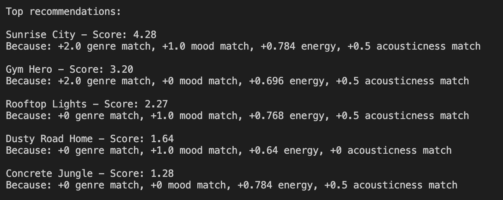
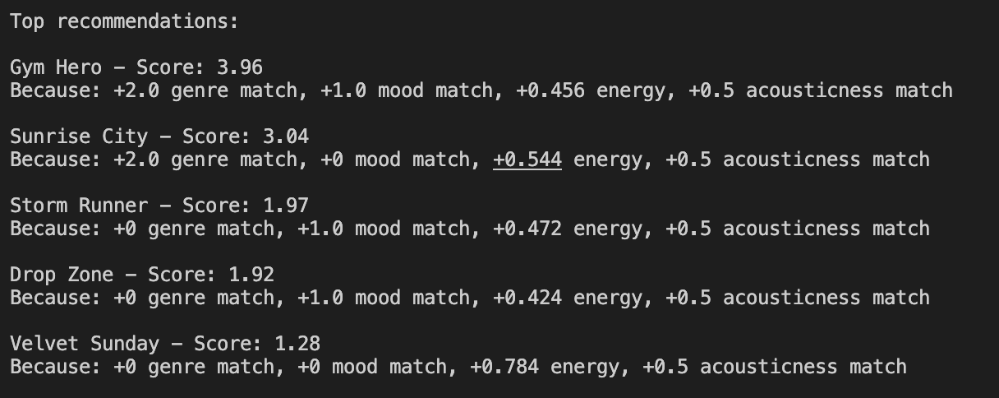
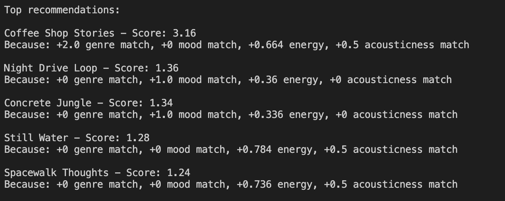
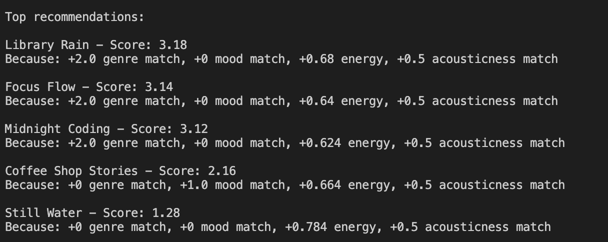

# 🎵 Music Recommender Simulation

## Project Summary

In this project you will build and explain a small music recommender system.

Your goal is to:

- Represent songs and a user "taste profile" as data
- Design a scoring rule that turns that data into recommendations
- Evaluate what your system gets right and wrong
- Reflect on how this mirrors real world AI recommenders

Replace this paragraph with your own summary of what your version does.

---

## How The System Works

Some prompts to answer:

The user profile is stored in a taste profile
{favorite_genre: 'lofi'
    favorite_mood: 'calm'
    target_energy: 0.35
    likes_acoustic: True}

Real world recommendation systems have scores for different attributes of songs -- like genre, temp, mood, etc. and compare those attributes for the current/chosen song and possible songs to recommend. This is done from a combination of input data and user preferences which generate recommendations. Specifically, the recommendation systems have input data based on how other users perceive the song (skips, play time). The input data could also include basic information about the song (artist, genre, etc.). They also have a user preference built for each consumer. The systems can pair those preferences with the input data to make the best recommendations. In reality, these systems use complex score calculation systems based on cosine similarities calculated from vectors of collected data about the songs and user preferences. For this project, we will not be going into as much depth.

My system would take genre, mood, energy, valence, acousticnes, danceability, and tempo into account. However, tests are structured to only include genre, mood, energy and acousticness in the taste profile so I'm only looking at those. All of them are represented numerically from 0 to 1 except with genre and mood by strings. For genre and mood, the recommendation system looks for a binary match, for target energy it considers 1 minus the difference between the values, and for likes acousticness, it rounds the acousticness of the sound to one or zero and assesses match or no match. These score are then summed up with different weightages to find the score for the song match. In this system, genre and mood get the most weightage, making a little bit less than 50% of the decisionmaking. More details on how the score is generated can be found in recommendation_system.txt.

The tool chooses songs to recommend by looping through the songs in the csv and finds the score for how well each one matches. A higher score indicates a better match. It's important to note that genre and mood are weighted much higher than acousticness. So, a poor acousticness match may be included

## Getting Started

### Setup

1. Create a virtual environment (optional but recommended):

   ```bash
   python -m venv .venv
   source .venv/bin/activate      # Mac or Linux
   .venv\Scripts\activate         # Windows

2. Install dependencies

```bash
pip install -r requirements.txt
```

3. Run the app:

```bash
python -m src.main
```

### Running Tests
Default Test (Happy Pop):
user_prefs = {"genre": "pop", "mood": "happy", "energy": 0.8, "likes_acoustic": False}

Results make sense based on happy pop profile! Songs are all high energy, happy sounding. 

Additional Test 1 (Intesnse Pop):
user_prefs = {"genre": "pop", "mood": "intense", "energy": 0.5, "likes_acoustic": False}

Good to see that some of the songs recomended and orderings differ from happy pop since there is a different mood. 

Additional Test 2 (Moody Jazz):
user_prefs = {"genre": "jazz", "mood": "moody", "energy": 0.2, "likes_acoustic": True}

Accousticness match is good to see for jazz profile since a key attribute of jazz music is that it is largely acoustic. Interesting how the top recommendation is not a mood match but makes sense based on overall score.

Additional Test 3 (Low Energy Lofi):
user_prefs = {"genre": "lofi", "mood": "relaxed", "energy": 0.2, "likes_acoustic": True}

Recommendations clearly lean in the "background music" direction, as expected. Some overlap with results from jazz profile -- makes sense because their is overlap in jazz and lofi music. 


Run the starter tests with:

```bash
pytest
```
python -m pytest works, above does not

You can add more tests in `tests/test_recommender.py`.

---

## Experiments You Tried

Use this section to document the experiments you ran. For example:

Changing swapping weightage of genre and mood
- for each user profile, i consistently got the same songs when trying the same user profile for 1x mood, 2x genre and 2x mood and 1x genre weightages. however, the ordering often moved around a bit. this is likely because the test sets I used generally "made sense" in that I didn't try an intense "intense lofi" or something else that wouldn't exist in real life.

Doubling weightage of energy, halving importance of genre
- surprisingly, this didn't have a signficant impact. In addition to the same user profiles generating the same list of songs with the weightage changes, the orders also largely stayed the same. This is because very few songs were energy matches but not genre and mood matches. So, the added weightage for those energy matches didn't compensate for the presence or lack of a genre match and overpower it. 

- How did your system behave for different types of users
The system effectively suggests different songs for different types of users. This is clear from the songs recommended for the "pop" centric profiles and "lofi" centric profile. So, the system is responding well to genre and other related preferences.

---

## Limitations and Risks

Some key limitations are that the recommendation algorithm is very simple, that it doesn't take language into account, and that music preferences can be arbitrary and this model doesn't have a way for compensating for that "unexpected" component. I generated more attributes but to avoid disrupting the given testing suite, I matched by user profile to what was given, and so only took those factors into consideration for the recommendation. Other limitations are as discussed earlier -- because genre is weighed more heavily than the other factors, a good genre match will likely make it into the top ranking even if other attributes don't match as well. 

---

## Reflection

Read and complete `model_card.md`:

[**Model Card**](model_card.md)

Write 1 to 2 paragraphs here about what you learned:

- about how recommenders turn data into predictions
Binary/categorical data presents more challenges, but it's interesting to see how recommendation systems can turn data into predictions. Each data point itslef would likely lead to a different recommendation but putting them together, it's possible to get a hollistic view. Though it wasn't implemeneted in this project, something more complext like vectors and cosine similarity could yield an even more nuanced result. For example, this model just considers genre as a binary match or fail when in reality, some genres are more simpilar than others. Using NLP tools to generate a better metric for similarity between genres would be helpful in giving more targetted recommendations.

- about where bias or unfairness could show up in systems like this

It's easy to see how bias or unfairness could show up in systems like this. In the grand scheme of things, song recommendations isn't that serious. However, it could be really relevant in things like classifying people to certain statuses. Because of historic and continued prejudices, there are higher rates of incarceration among racial minorities -- especially black and brown communities. So, if a model was trained on existing data and the weightages of certain attributes were decided based on existing data, it may not recommend black and brown people for things like "best potential tenant". This weightage decided based on existing (prejudiced) data could have continued impacts. Other things like recommendations for health procedures or diagnoses could also be affected. If an insurance company made a tool, they could adjust the weightage so the highest out of pocket cost treatments would be recommended first, followed by the ones where the insurance company would bear more of a financial burden.


---

## 7. `model_card_template.md`

Combines reflection and model card framing from the Module 3 guidance. :contentReference[oaicite:2]{index=2}  

```markdown
# 🎧 Model Card - Music Recommender Simulation

## 1. Model Name

Give your recommender a name, for example:

> MusicMatch 1.0

---

## 2. Intended Use

This system suggests 5 songs from a catalog of 20 songs based on the user's preference profile. The profile consists of the user's genre, mood, energy level, and acousticness preferences. This recommendation system is very simple and uses fake songs, so it is just for an exploratory project. However, real music recommendation systems are for people trying to discover new music. 

---

## 3. How It Works (Short Explanation)

The scoring considers genre with 2.0 weightage (match or no match), mood with 1.0 weightage (match or no match), energy level with 0.8 weightage (1 minus the difference in energy levels of the song and user profile), and acousticness with 0.5 weightage (user likes it or not, song is classified as acoustic or not and system looks for match or no match). Each of these values are available for each song and the user profile. The scores for each of these categories is put together to get the final match score. A higher score indicates a better match. 

---

## 4. Data

Describe your dataset.

- How many songs are in `data/songs.csv`
- Did you add or remove any songs
- What kinds of genres or moods are represented
- Whose taste does this data mostly reflect

There are 20 songs in data/songs.csv -- I added 10 in addition to the 10 that were there to begin with. Some of the genres represented are pop, lofi, and rock. Some of the moods represented are happy, chill, intesne. Since Claude added 10 additoinal songs, this data should be pretty neutral. This is especially true because I asked it to try to add types of songs not already in the dataset.

---

## 5. Strengths

Where does your recommender work well

You can think about:
- Situations where the top results "felt right"
- Particular user profiles it served well
- Simplicity or transparency benefits

The recommender works well when the user wants a song that matches their favorite genre or mood. However, if they want a song that matches their energy better, they may have to reweigh the recommendation tool. It worked well for each profile tested, though they may not have been as nuanced as I liked. This is also because there aren't many songs to pull from. So there may be more overlap between categories like jazz and lofi that do overlap in real life but not to the same degree as they seem to from test results.

---

## 6. Limitations and Bias

Where does your recommender struggle

The recommender does not take tempo or danceability into account, both of which may be key attributes in some recommendation. It also treats all users as if they have the same "taste shape" in that they weigh genre, mood, energy, and acousticness in the same way, the way I designated in my model. It is not biased toward any one genre or energy level by default. This would be unfair if used in a real product because songs where the energy does not match what traditionally matches the genre will likely not be recommended even if they are good energy matches for the user. 

---

## 7. Evaluation

I checked my system by testing various user profiles and checking whether the recommendations matched my expectations. I found that different profiles did recommend different songs, and in different orders. The song recommendtions also matched the profiles I was inputting. 

---

## 8. Future Work

If you had more time, how would you improve this recommender

If I had more time, I would go back and add attributes for the recommender system to consider -- both to each song's profile and the user profiles. That way, they would have better, more nuanced data to go off of. I would also add features like lyric themes -- for example, people that are graduating soon may want recommendations of songs about big changes, rather than just "happy pop" broadly. 

---

## 9. Personal Reflection

A few sentences about what you learned:

One thing that surprised me was how the system was able to recommend songs that matched the user profile even with such little information. It's clear that with more data and more complex comparisons, recommendations could work even better. Building this also made me realize how complex real music recommenders must be. However, I think with music, as with all types of art, human judgement still matters. Users with the same taste profile may have very different opinions based on recommended songs. Some things, like songs sounding "off" to some users may be hard to quantify. People also often surprise themselves with what they like, so there may be a song they never get recommended that they may love. 